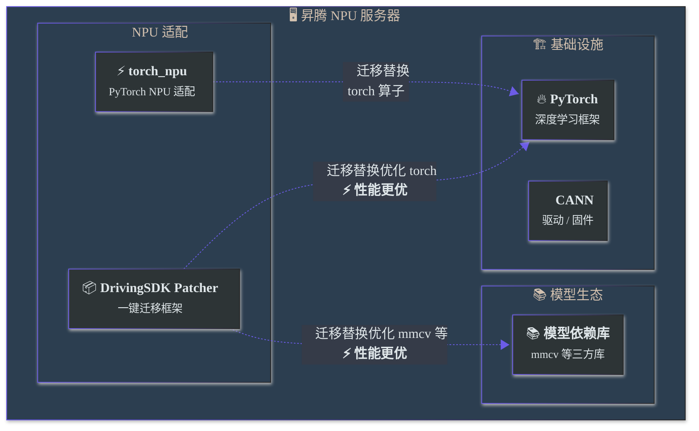
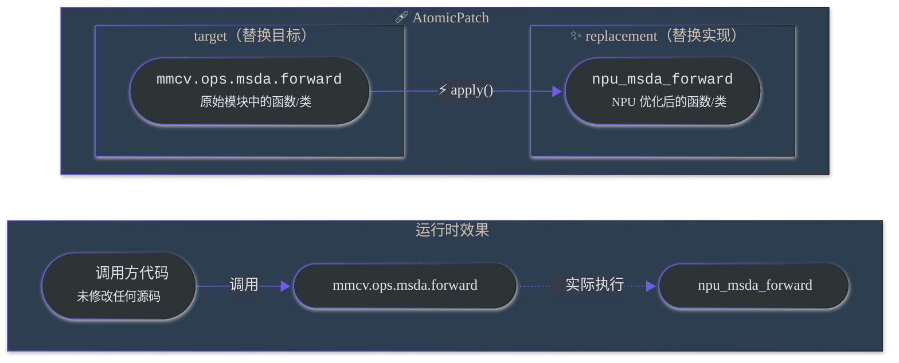

# 一键Patcher 2.0

> **2.0 重构版本**：Patcher 已完成从命令式到声明式的架构重构，提供更精细的补丁粒度、更好的可追踪性和错误定位。1.0 API 保留完全兼容，但推荐使用 2.0 写法。

## 为什么需要一键Patcher？

开源自动驾驶模型通常基于 **CUDA 生态**开发。昇腾（Ascend）NPU 的芯片架构与 GPU 存在本质差异——算子实现、内存管理、软件栈调用方式均不相同。这意味着将开源模型迁移到昇腾平台时，开发者需要：

- 替换 CUDA 专属算子为 NPU 实现
- 处理不兼容的第三方库（如 `flash_attn`、`torch_scatter`）
- 调整数据格式与精度策略
- 修改分布式训练逻辑

这些适配工作分散在大量文件中，传统做法是直接修改模型源代码。这会带来几个问题：**代码管理混乱**（原始代码与适配代码混杂）、**升级困难**（上游更新后需重新适配）、**第三方库修改后需重新编译**（如 mmcv 的自定义算子）。

**一键Patcher 的定位**就是解决这些问题。它是一个基于 Monkey Patch 的运行时替换框架，核心理念是：

> **零侵入迁移** —— 不修改任何原始代码的一个字符，通过运行时动态替换实现 CUDA → NPU 的适配。

具体而言，一键Patcher：

| 解决的问题 | 如何解决 |
|------------|----------|
| 迁移工作量大、门槛高 | 封装常见适配为预定义补丁，`apply()` 一行代码即可应用 |
| 修改三方库源码需重新编译 | 运行时替换，无需修改和编译 mmcv 等库的源代码 |
| 适配代码与原始代码耦合 | 补丁独立于模型代码，实现**源代码（Source Code）**与**迁移代码（Migration Code）**完全解耦 |
| 迁移经验难以复用 | 将已验证的适配方案沉淀为预定义补丁，新模型可直接复用 |
| 缺少昇腾环境的实用功能 | 内置性能采集、训练早停、NPU 格式控制等工具 |

---

## 执行流程

### 整体环境

一键Patcher 在以下环境链中工作：



### 一行代码迁移

假设你有一个基于 CUDA 的开源模型，需要在昇腾机器上运行。整个迁移过程如下：

```python
# train.py —— 模型原始训练脚本的最顶部，添加以下两行：

from mx_driving.patcher import default_patcher
default_patcher.apply()

# ↓↓↓ 以下是模型原始代码，一个字符都不需要改 ↓↓↓
import mmcv
import torch
from my_model import build_model
...
```

### apply() 背后发生了什么？

```mermaid
---
config:
  look: neo
  theme: base
  themeVariables:
    primaryColor: "#2d3436"
    primaryTextColor: "#dfe6e9"
    primaryBorderColor: "#6c5ce7"
    secondaryColor: "#353b48"
    tertiaryColor: "#2c3e50"
    lineColor: "#6c5ce7"
    fontFamily: "Segoe UI, Microsoft YaHei, sans-serif"
---
flowchart TD
    A(["🚀 <b>default_patcher.apply&#40;&#41;</b>"])
    A --> B1(["📥 ① 导入控制"])
    A --> B2(["🩹 ② 补丁替换"])
    A --> B3(["⚙️ ③ 环境配置"])

    subgraph S1 ["📥 导入控制"]
        B1 --> C1(["🚫 skip_import<br/><small>拦截 CUDA 模块的 import</small>"])
        B1 --> C2(["🔄 replace_import<br/><small>替换模块为 NPU 实现</small>"])
    end

    subgraph S2 ["🩹 补丁替换"]
        B2 --> D1(["🔍 遍历所有补丁<br/><small>预定义 + 自定义</small>"])
        D1 --> D2(["⚡ AtomicPatch<br/><small>target → replacement</small>"])
    end

    subgraph S3 ["⚙️ 环境配置"]
        B3 --> E1(["🎛️ NPU 设置<br/><small>内部格式 / profiling</small>"])
    end

    C1 & C2 & D2 & E1 --> F(["🔗 被替换过的函数/类<br/>已经是 NPU 版本"])
    F --> G(["✅ <b>模型在昇腾 NPU 上运行</b><br/>原始代码零修改"])
```



**关键要点**：`apply()` 必须在所有其他 `import` 之前调用。因为 Patcher 通过替换模块属性实现补丁——如果目标模块已经被导入并且其属性已被其他模块引用，补丁将无法生效。

---

## 核心概念：Atomic Patch

一键Patcher 的最小工作单元是 **AtomicPatch**（原子补丁），它执行一次精确的运行时替换：



- **target**：被替换的原始属性路径（如 `"mmcv.ops.msda.forward"`）
- **replacement**：替换后的新实现（NPU 优化版本）

模型原始代码中调用 `mmcv.ops.msda.forward()` 的地方，在 `apply()` 之后实际执行的是 NPU 版本，而代码文本没有任何变化。

### Patch 与 Patcher

| 概念 | 说明 |
|------|------|
| **AtomicPatch** | 最小补丁单元，执行单个 target → replacement 替换 |
| **Patch** | 组合补丁，将多个相关的 AtomicPatch 组织在一起（如一个算子的 forward + backward） |
| **Patcher** | 补丁管理器，收集、组织和应用所有补丁，并提供导入控制等辅助功能 |
| **default_patcher** | 预配置的 Patcher 实例，已包含常用预定义补丁，开箱即用 |

---

## 快速开始

### 最简用法

在训练脚本（通常是`train.py`）的**最顶部**（所有其他import之前）添加：

```python
# train.py 最顶部
from mx_driving.patcher import default_patcher
default_patcher.apply()

# 然后是训练脚本原本的代码
import mmcv
import warnings
……
```

> **为什么要放在最上方？** Patcher通过Monkey Patch机制替换目标模块的函数/类。如果目标模块在`apply()`之前已被导入，补丁可能无法正确生效。
> **关于torch/torch_npu依赖**：Patcher内部会自动处理torch和torch_npu的导入，用户无需在导入patcher之前手动导入这些模块。

如果你的模型除了 `default_patcher` 里的默认补丁之外，还需要额外配置导入控制或项目补丁，推荐入口写法是：

```python
from mx_driving.patcher import default_patcher
from migrate_to_ascend.patch import configure_patcher

configure_patcher(default_patcher)
default_patcher.apply()

from tools.train import main
main()
```

### default_patcher 说明

`default_patcher` 是框架预配置的 Patcher 实例，已包含常用的NPU优化补丁（针对mmcv、torch、numpy等库的补丁，详情参考[预定义补丁列表](#预定义补丁)）。

**注意**：`default_patcher` 不保证所有模型的迁移完备性。部分模型可能需要额外添加自定义补丁来处理特定的CUDA依赖或算子替换。

### default_patcher + 自定义补丁

在 `default_patcher` 基础上添加自定义补丁：

```python
from mx_driving.patcher import default_patcher, Patch, AtomicPatch
from mx_driving.patcher.patch import with_imports

class MyCustomPatch(Patch):
    """自定义补丁描述"""

    @classmethod
    def patches(cls, options=None):
        return [
            AtomicPatch(
                "target_module.target_function",
                cls._replacement,
                precheck=cls._precheck,        # 可选：应用前检查
                runtime_check=cls._runtime_check,  # 可选：运行时检查
            ),
            # 可以返回多个 AtomicPatch...
        ]

    @staticmethod
    def _precheck():
        """应用前检查，返回 False 则跳过此补丁"""
        ...

    @staticmethod
    def _runtime_check(*args, **kwargs):
        """运行时检查，返回 False 则回退到原函数"""
        ...

    @staticmethod
    @with_imports("module")  # 声明函数依赖的外部模块
    def _replacement(...):
        """替换函数实现"""
        ...

default_patcher.add(MyCustomPatch)
default_patcher.apply()
```

说明：

- `Patch.name` 现在是可选的；如果不显式定义，会自动使用类名作为默认标识。
- 当补丁名需要作为对外稳定标识、跨重构保持不变，或需要兼容既有 `legacy_name` / 禁用配置时，仍建议显式写 `name`。
- `disable()` 既支持字符串名，也支持直接传 `Patch` 类或补丁实例，例如 `default_patcher.disable(MyCustomPatch)`。
- 如果你要替换 `default_patcher` 中已启用的某个冲突补丁，推荐先 `disable()` 默认补丁，再 `add()` 你想启用的补丁。

例如：

```python
from mx_driving.patcher import ResNetFP16, ResNetMaxPool

default_patcher.disable(ResNetMaxPool).add(ResNetFP16)
```

### 具体示例：高斯核权重计算的NPU优化

下面通过一个完整示例，演示如何将CUDA实现替换为NPU优化实现。

**Step 1：原始CUDA实现**

假设目标模块 `my_model.ops.gaussian` 中有如下函数，使用CUDA进行高斯核权重计算：

```python
# 文件：my_model/ops/gaussian.py（原始CUDA实现）
import math
import torch

def compute_gaussian_weights(distances, sigma):
    """计算高斯核权重（CUDA版本）"""
    variance = 2.0 * sigma * sigma
    weights = torch.exp(-distances * distances / variance)
    norm_factor = 1.0 / (sigma * math.sqrt(2 * math.pi))
    return weights * norm_factor
```

**Step 2：NPU优化实现**

在NPU上，我们希望使用 `torch_npu` 提供的融合算子来提升性能：

```python
# NPU优化版本（理想效果）
import math
import torch_npu

def compute_gaussian_weights(distances, sigma):
    """计算高斯核权重（NPU优化版本）"""
    variance = 2.0 * sigma * sigma
    weights = torch_npu.npu_exp(-distances * distances / variance)  # 使用NPU融合算子
    norm_factor = 1.0 / (sigma * math.sqrt(2 * math.pi))
    return weights * norm_factor
```

**Step 3：编写Patch实现替换**

现在编写补丁，让Patcher自动完成上述替换：

```python
from mx_driving.patcher import default_patcher, Patch, AtomicPatch
from mx_driving.patcher.patch import with_imports
import torch

class GaussianWeightsPatch(Patch):
    """高斯核权重计算NPU优化"""
    name = "gaussian_weights"

    @classmethod
    def patches(cls, options=None):
        return [
            AtomicPatch(
                "my_model.ops.gaussian.compute_gaussian_weights",
                cls._compute_gaussian_weights_npu,
                runtime_check=cls._check_fp32,  # 仅FP32输入时使用NPU优化
            ),
        ]

    @staticmethod
    def _check_fp32(distances, sigma):
        """运行时检查：仅FP32输入使用NPU优化，其他dtype回退原实现"""
        return distances.dtype == torch.float32

    @staticmethod
    @with_imports("math", "torch_npu")  # 声明函数依赖的外部模块
    def _compute_gaussian_weights_npu(distances, sigma):
        """NPU优化实现"""
        variance = 2.0 * sigma * sigma
        weights = torch_npu.npu_exp(-distances * distances / variance)  # noqa: F821
        norm_factor = 1.0 / (sigma * math.sqrt(2 * math.pi))  # noqa: F821
        return weights * norm_factor

default_patcher.add(GaussianWeightsPatch)
default_patcher.apply()
```

**关键点说明：**

| 特性 | 作用 |
|------|------|
| `with_imports` | 声明函数依赖的外部模块（字符串形式导入整个模块，元组形式导入特定名称） |
| `runtime_check` | 运行时检查输入dtype，仅FP32时使用NPU优化，FP16/BF16自动回退原实现 |
| `AtomicPatch` | 指定替换目标路径和替换函数 |

### 常用功能速览

```python
from mx_driving.patcher import default_patcher, AtomicPatch, replace_with

default_patcher.skip_import("<cuda_module>")                    # 跳过CUDA模块
default_patcher.replace_import("<old_module>", "<new_module>")  # 推荐：整模块替换
default_patcher.inject_import("<src>", "<name>", "<target>")    # 注入导入
default_patcher.add(AtomicPatch("<target>", replacement))       # 添加补丁
default_patcher.with_profiling("<output_dir>")                  # 性能采集
default_patcher.brake_at(<step>)                                # 训练早停
default_patcher.allow_internal_format()                         # 允许NPU内部格式
default_patcher.apply()                                         # 应用所有
```

当需要“只替换模块里的部分导出”或“以某个模块为模板再覆写少量导出”时，再使用 `replace_with.module(...)`。这属于 `replace_import` 的进阶能力，不建议把它当作常用入口；详细机制和示例放在 [FEATURES.md](./FEATURES.md) 的 `replace_import` 小节里单独说明。

### 导入控制怎么选

三类导入控制解决的是三个不同问题，首次使用时建议按下面判断：

| 场景 | 推荐API | 典型例子 |
|------|---------|----------|
| 模块在昇腾环境根本不存在，但后续路径并不会真正执行它 | `skip_import()` | `flash_attn`、`torch_scatter` 只是在顶部被 import，真实执行路径会被 NPU patch 接管 |
| 问题就发生在模块 import 边界，需要把整个模块入口换掉 | `replace_import()` | DiffusionDrive 把 `projects.mmdet3d_plugin.ops.deformable_aggregation` 的导出切到 NPU 实现 |
| 类/函数定义在子模块里，但父模块没有正确导出，导致 `from pkg import Name` 失败 | `inject_import()` | DiffusionDrive 把 `V1SparseDrive`、`V1SparseDriveHead` 等类补回 `projects.mmdet3d_plugin.models` |

一个真实的 `configure_patcher()` 片段通常会同时用到三者：

```python
patcher.skip_import("flash_attn", "torch_scatter")
patcher.replace_import(
    "projects.mmdet3d_plugin.ops.deformable_aggregation",
    DeformableAggregationFunction=_DeformableAggregationFunction,  # 仓内现有兼容写法
)
patcher.inject_import(
    "projects.mmdet3d_plugin.models.sparsedrive_v1",
    "V1SparseDrive",
    "projects.mmdet3d_plugin.models",
)
```

上面这类“只替换导出表”的写法，仓内现有代码里仍能看到直接传 `**kwargs` 的兼容形式；新代码更推荐写成 `replace_with.module(DeformableAggregationFunction=...)`。

---

## 功能概览

每个功能的详细用法、参数说明和示例请参阅 [FEATURES.md](./FEATURES.md)。

### 导入控制

| 功能 | 用途 | 典型场景 |
|------|------|----------|
| [skip_import](./FEATURES.md#skip_import---跳过不可用模块) | 跳过不存在的 CUDA 模块 | 运行时 `ModuleNotFoundError`，该模块是 CUDA 专属的 |
| [replace_import](./FEATURES.md#replace_import---替换模块导入) | 用模块替身替换整个模块 | CUDA 算子模块需替换为 NPU 版本 |
| [inject_import](./FEATURES.md#inject_import---注入缺失导入) | 向目标模块注入缺失的导入 | 模型代码遗漏了某些 import 导致运行报错 |

### 补丁机制

| 功能 | 用途 | 典型场景 |
|------|------|----------|
| [AtomicPatch](./FEATURES.md#atomicpatch---原子补丁) | 单个属性的 target → replacement 替换 | 替换某个函数为 NPU 版本 |
| [Patch](./FEATURES.md#patch---组合补丁) | 组织多个相关的 AtomicPatch | 一个算子的 forward + backward |
| [aliases](./FEATURES.md#aliases---处理模块重导出) | 确保所有访问路径都被替换 | target 通过 `__init__.py` 或 `import as` 存在多个路径 |
| [precheck](./FEATURES.md#precheck---应用前条件检查) | 应用前检查条件，条件不满足则跳过 | 仅在特定 mmcv 版本下应用 |
| [runtime_check](./FEATURES.md#runtime_check---运行时条件分发) | 运行时按输入动态选择实现 | 仅对 FP32 输入使用 NPU 优化 |
| [with_imports](./FEATURES.md#with_imports---延迟导入装饰器) | replacement 函数的延迟导入声明 | 避免循环导入，保持代码风格一致 |

### 辅助工具

| 功能 | 用途 |
|------|------|
| [with_profiling](./FEATURES.md#with_profiling---性能采集) | NPU 性能数据采集 |
| [brake_at](./FEATURES.md#brake_at---训练早停) | 在指定步数停止训练（调试/性能测试用） |
| [allow_internal_format](./FEATURES.md#allow_internal_format---npu-内部格式控制) | 控制 NPU 内部数据格式 |
| [日志配置](./FEATURES.md#日志配置) | 配置补丁应用的日志行为 |
| [print_info](./FEATURES.md#补丁状态查看) | 查看补丁应用状态和代码 diff |

---

## 预定义补丁

框架内置了经过验证的 NPU 适配补丁，将已有的迁移经验沉淀下来，新模型可直接复用：

| 模块 | 补丁名称 | 说明 | default_patcher |
|------|----------|------|:---------------:|
| **mmcv** | MultiScaleDeformableAttention | 多尺度可变形注意力 | ✅ |
| | DeformConv | 可变形卷积 | ✅ |
| | ModulatedDeformConv | 调制可变形卷积 | ✅ |
| | SparseConv3D | 3D稀疏卷积 | ✅ |
| | Stream | CUDA 流管理 | ✅ |
| | DDP | 分布式数据并行 | ✅ |
| | Voxelization | 体素化 | ❌ |
| | OptimizerHooks | 优化器钩子（mmcv 1.x） | ❌ |
| **mmengine** | OptimizerWrapper | 优化器包装器 | ❌ |
| **mmdet** | PseudoSampler | 伪采样器 | ❌ |
| | ResNetAddRelu | ResNet 加 ReLU 融合 | ✅ |
| | ResNetMaxPool | ResNet 最大池化 | ✅ |
| | ResNetFP16 | ResNet FP16 支持 | ❌ |
| **mmdet3d** | NuScenesDataset | NuScenes 数据集 | ✅ |
| | NuScenesMetric | NuScenes 评估指标 | ✅ |
| **numpy** | NumpyCompat | NumPy 兼容性修复 | ✅ |
| **torch** | TensorIndex | 张量索引优化 | ✅ |
| | BatchMatmul | 批量矩阵乘法 | ✅ |
| **torch_scatter** | TorchScatter | scatter 操作 NPU 实现 | ❌ |

> ✅ = 已包含在 `default_patcher` 中，`apply()` 即生效。❌ = 需通过 `patcher.add()` 手动添加。
> `NumpyCompat` 属于默认补丁中的早期兼容补丁，会先于后续 `Patch` 类收集过程生效，用于恢复 `np.bool` / `np.float` / `np.int` 等已移除别名，避免第三方库在 import-time 就因 NumPy 兼容性问题提前失败。

---

## 最佳实践：迁移代码的文件组织

推荐将所有迁移相关代码集中在独立的 `migrate_to_ascend/` 文件夹中，实现**源代码**（模型原始代码）与**迁移代码**（NPU 适配代码）的物理解耦：

```shell
my_model/                          ← 源代码（Source Code）
├── configs/                         不做任何修改
├── projects/
│   ├── models/
│   └── ops/
├── tools/
│   ├── train.py                     原始训练脚本
│   └── test.py
│
├── migrate_to_ascend/             ← 迁移代码（Migration Code）
│   ├── patch.py                     补丁定义和 patcher 配置
│   ├── train.py                     昇腾训练入口（基于原始 train.py，顶部加入 patcher 代码）
│   ├── test.py                      昇腾测试入口（基于原始 test.py，顶部加入 patcher 代码）
│   ├── train_8p.sh                  8卡分布式训练脚本
│   └── requirements.txt             昇腾环境依赖
│
├── README.md
└── setup.py
```

**这种组织方式的优势**：

- **零侵入**：`my_model/` 下的所有文件不做任何修改
- **一键迁移**：将 `migrate_to_ascend/` 文件夹拷入开源模型仓即可运行
- **双栈共存**：同一个仓库、同一个分支可以同时支持 CUDA 和昇腾两种环境
- **独立管理**：迁移代码的版本控制与模型原始代码互不干扰

> **关于 `migrate_to_ascend/train.py` 和 `test.py`**：这两个文件是从模型原始代码的 `tools/train.py` 和 `tools/test.py` **复制**而来，然后在脚本最顶部插入 Patcher 的导入和应用代码。这样做的好处是保持原始脚本完全不变，同时昇腾入口脚本与原始脚本的差异仅在于顶部多了几行 Patcher 代码。

**训练入口示例**（`migrate_to_ascend/train.py`）：

```python
# migrate_to_ascend/train.py
from mx_driving.patcher import default_patcher
from migrate_to_ascend.patch import configure_patcher

configure_patcher(default_patcher)
default_patcher.apply()

# 调用模型原始的训练逻辑
from tools.train import main
main()
```

实际项目参考：[DiffusionDrive](../../model_examples/DiffusionDrive/migrate_to_ascend/) 和 [PanoOcc](../../model_examples/PanoOcc/migrate_to_ascend/) 的 `migrate_to_ascend/` 目录。

---

## 更多文档

| 文档 | 内容 |
|------|------|
| [FEATURES.md](./FEATURES.md) | 架构概览、各功能的详细用法、使用场景和示例、进阶用法、API 参考、2.0写法优势 |
